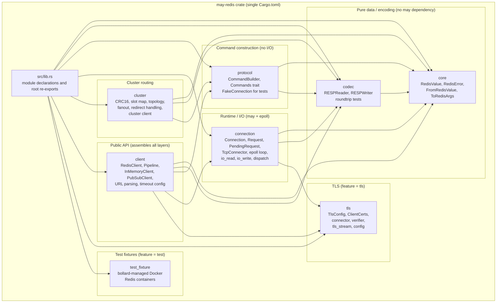
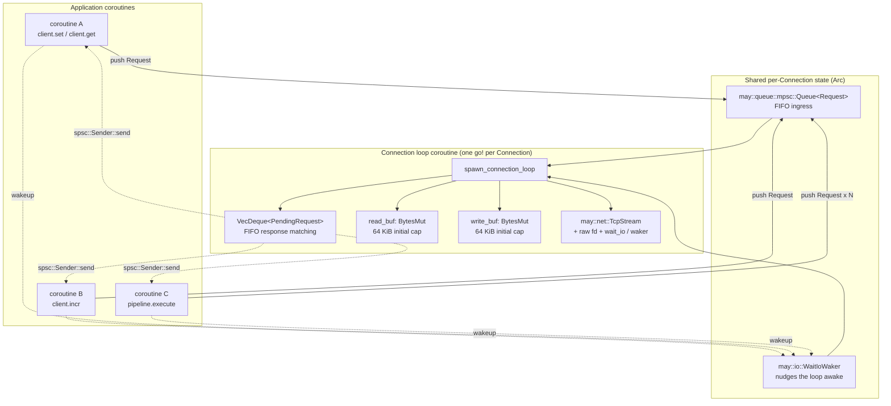
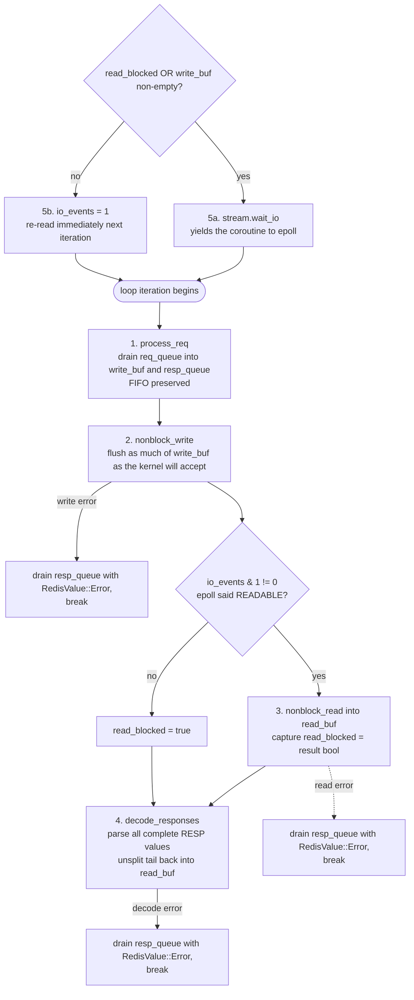
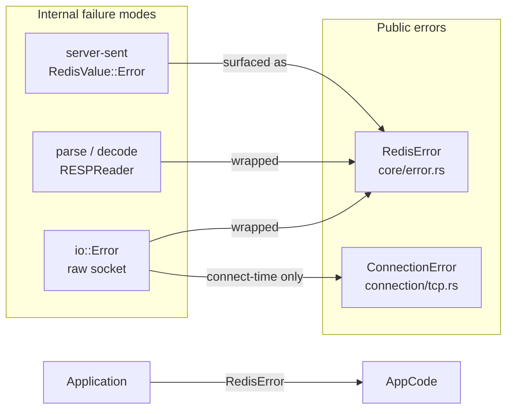
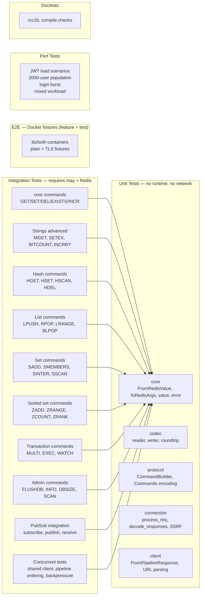

# may-redis Architecture

Canonical, code-accurate architecture reference for `may-redis`. If this
document and any other doc disagree, this one is right and the other one
needs updating. If this document and the code disagree, the code is right
and **this** document needs updating — open an issue.

- **Crate**: `may-redis` v0.1.0 (single crate, see
  [`docs/adr-001-single-crate-structure.md`](./adr-001-single-crate-structure.md))
- **Runtime**: [`may`](https://crates.io/crates/may) 0.3 stackful coroutines.
  Zero tokio, zero `async`/`.await`.
- **Wire protocol**: RESP2 only.
- **Reference implementation for the connection layer**:
  `../may_postgres/src/connection.rs` — when in doubt, mirror it.

## 1. Goals and non-goals

### Goals

1. **may-native Redis client.** The only allowed runtime is `may`. All
   I/O cooperation goes through may primitives (`go!`,
   `may::net::TcpStream`, `may::sync::spsc`,
   `may::queue::mpsc::Queue`, `WaitIo` / `WaitIoWaker`).
2. **API-compatible with the `redis` crate, where it matters.** The
   `Commands` trait surface (`get`, `set`, `incr`, `del`, `exists`,
   `ttl`, `expire`, `publish`, `keys`, `dbsize`, `flushdb`, `ping`,
   `auth`) is shaped for mechanical migration from `redis` to
   `may-redis`.
3. **Multi-coroutine sharing of one TCP socket.** A single
   `Connection` is cheap to `Arc`-share across many application
   coroutines; the connection loop demultiplexes responses back to the
   correct caller in FIFO order.
4. **First-class pipelines.** `Pipeline::add(..)` + `Pipeline::execute()`
   flushes N commands in one batch and reassembles N typed responses.
5. **Test-without-Redis option.** `InMemoryClient` (feature `test`)
   provides a clean per-test in-memory backend implementing the
   `Commands` semantics, so unit tests of higher-level code don't need
   a running server.
6. **Docker-managed integration tests.** Bollard-based test fixtures
   (feature `test`) spin up isolated Redis containers (plain + TLS)
   per test run, auto-clean on drop, skip gracefully when Docker is
   unavailable.

### Non-goals (out of scope for v1)

- RESP3 type markers (`~`, `=`, `_`, `,`, `%`, `>`).
- Connection pooling — every `RedisClient` owns exactly one socket
  today. (Pool support is reserved for a future epic.)
- Publication to crates.io. The crate is consumed from sibling
  microscaler repos via path / git dependencies.
- Streams, Geo, HyperLogLog data types — reserved for future epics.

## 2. Crate shape

Single crate, single `Cargo.toml`, eight top-level modules under `src/`.


```mermaid
graph TB
    subgraph "may-redis crate (single Cargo.toml)"
        Lib[src/lib.rs<br/>module declarations and root re-exports]

        subgraph "Pure data / encoding (no may dependency)"
            Core[core<br/>RedisValue, RedisError,<br/>FromRedisValue, ToRedisArgs]
            Codec[codec<br/>RESPReader, RESPWriter<br/>roundtrip tests]
        end

        subgraph "Command construction (no I/O)"
            Protocol[protocol<br/>CommandBuilder, Commands trait<br/>FakeConnection for tests]
        end

        subgraph "Runtime / I/O (may + epoll)"
            Connection[connection<br/>Connection, Request, PendingRequest,<br/>TcpConnector, epoll loop,<br/>io_read, io_write, dispatch]
        end

        subgraph "Cluster routing"
            Cluster[cluster<br/>CRC16, slot map, topology,<br/>fanout, redirect handling,<br/>cluster client]
        end

        subgraph "Public API (assembles all layers)"
            Client[client<br/>RedisClient, Pipeline,<br/>InMemoryClient, PubSubClient,<br/>URL parsing, timeout config]
        end

        subgraph "TLS (feature = tls)"
            TLS[tls<br/>TlsConfig, ClientCerts,<br/>connector, verifier,<br/>tls_stream, config]
        end

        subgraph "Test fixtures (feature = test)"
            Fixture[test_fixture<br/>bollard-managed Docker<br/>Redis containers]
        end

        Lib --> Core
        Lib --> Codec
        Lib --> Protocol
        Lib --> Connection
        Lib --> Cluster
        Lib --> Client
        Lib --> TLS
        Lib --> Fixture

        Codec --> Core
        Protocol --> Core
        Protocol --> Codec
        Connection --> Core
        Connection --> Codec
        Connection --> TLS
        Client --> Core
        Client --> Codec
        Client --> Protocol
        Client --> Connection
        Client --> TLS
        Cluster --> Core
        Cluster --> Codec
        Cluster --> Protocol
    end
```

### Module layer rules

| Layer | Modules | May / I/O? | Purpose |
|-------|---------|------------|---------|
| Data | `core`, `codec` | **No** | Pure types and RESP2 codec. Must build standalone. |
| Construction | `protocol` | **No** | Build RESP-encoded commands. No runtime, no sockets. |
| Runtime | `connection` | **Yes** | Owns the socket, runs the epoll loop, demultiplexes responses. |
| Cluster | `cluster` | **No** (data only) | CRC16 slot computation, topology parsing, redirect logic, fan-out. No network. |
| API | `client` | **Yes** | Public surface; assembles everything above. |

The "no may" rule for `core` / `codec` / `protocol` / `cluster` is a hard
architectural boundary. Any change that introduces a `may::` import in
those four modules should be rejected in review.

### File-level entry points

```text
src/
├── lib.rs                         Module roots, re-exports
├── core/
│   ├── mod.rs                     Re-exports
│   ├── value.rs                   RedisValue enum
│   ├── error.rs                   RedisError + RedisResult
│   ├── from_value.rs              FromRedisValue impls (primitives, Option, Vec, f64, u64, i32, u8)
│   └── to_args.rs                 ToRedisArgs trait + impls
├── codec/
│   ├── mod.rs                     Re-exports
│   ├── writer.rs                  RESPWriter (encoder, BytesMut-backed)
│   ├── reader.rs                  RESPReader (decoder, cursor-based, depth/length caps)
│   └── roundtrip.rs               encode-then-decode property tests
├── protocol/
│   ├── mod.rs                     Re-exports
│   ├── builder.rs                 CommandBuilder + cmd() free fn
│   ├── commands.rs                Commands trait + default impls
│   ├── commands/admin.rs          Server commands (PING, AUTH, FLUSHDB, etc.)
│   ├── commands/strings.rs        String commands (GET, SET, MGET, etc.)
│   ├── commands/hashes.rs         Hash commands (HSET, HGET, HSCAN, etc.)
│   ├── commands/lists.rs          List commands (LPUSH, RPOP, LRANGE, etc.)
│   ├── commands/sets.rs           Set commands (SADD, SMEMBERS, SINTER, etc.)
│   ├── commands/sorted_sets.rs    Sorted set commands (ZADD, ZRANGE, ZCOUNT, etc.)
│   ├── commands/transactions.rs   Transaction commands (MULTI, EXEC, WATCH)
│   ├── commands/pubsub.rs         Pub/Sub commands (SUBSCRIBE, PUBLISH)
│   ├── fake.rs                    FakeConnection for protocol testing
│   └── builder_tests.rs           CommandBuilder encoding tests
├── connection/
│   ├── mod.rs                     Re-exports
│   ├── connection.rs              Connection, Request, PendingRequest, spawn_connection_loop
│   ├── tcp.rs                     TcpConnector, ConnectionError, SSRF protection
│   ├── connection_stream.rs       Connection stream abstraction
│   ├── epoll_loop.rs              Epoll event loop (READABLE/WRITABLE handling)
│   ├── io_read.rs                 Non-blocking read with EPOLL drain
│   ├── io_write.rs                Non-blocking write
│   ├── dispatch.rs                Response dispatch via spsc channels
│   ├── pubsub.rs                  Pub/Sub message parsing
│   ├── connection_tls.rs          TLS connection wrapping
│   ├── connection_limits.rs       Resource limit configuration
│   ├── tcp_tests.rs               Connection error + SSRF + URL tests
│   ├── connection_tests.rs        Decode responses + process_req tests
│   └── test_limits.rs             Resource limit tests
├── cluster/
│   ├── mod.rs                     Re-exports
│   ├── crc16.rs                   CRC16 + hash-tag extraction (17 tests)
│   ├── slot_map.rs                Slot-to-node mapping
│   ├── topology.rs                Cluster slots/nodes parsing
│   ├── fanout.rs                  Multi-key fan-out, result aggregation
│   ├── redirect.rs                MOVED/ASK redirect handling
│   └── cluster_client.rs          ClusterClient (multi-node client)
├── client/
│   ├── mod.rs                     Re-exports
│   ├── client.rs                  RedisClient + Commands impl + integration tests
│   ├── pipeline.rs                Pipeline + FromPipelineResponse
│   ├── pipeline_response.rs       Tuple impls for pipeline response extraction
│   ├── in_memory.rs               InMemoryClient (feature = test)
│   ├── pubsub_client.rs           PubSubClient with dedicated connection
│   ├── client_url.rs              URL parsing (redis://, rediss://, query params)
│   ├── client_timeout.rs          Command policy + timeout config
│   ├── in_memory_tests.rs         InMemoryClient tests
│   ├── client_tests/              Comprehensive test suites
│   │   ├── mod.rs
│   │   ├── integration.rs         Core integration tests
│   │   ├── integration_strings_*.rs String command tests
│   │   ├── integration_hashes_*.rs Hash command tests
│   │   ├── integration_lists_basic.rs List command tests
│   │   ├── integration_sets_basic.rs Set command tests
│   │   ├── integration_sorted_sets.rs Sorted set tests
│   │   ├── integration_transactions.rs Transaction tests
│   │   ├── integration_admin_*.rs Admin command tests
│   │   ├── integration_pubsub.rs PubSub integration tests
│   │   ├── tls_tests/             TLS-specific integration tests
│   │   └── unit.rs                Unit tests for Commands trait
│   └── integration_tests.rs       (stub)
├── tls/
│   ├── mod.rs                     Re-exports
│   ├── config.rs                  TlsConfig, TlsVersion, RustlsRootCerts
│   ├── connector.rs               TlsConnector, from_tls_stream
│   ├── tls_stream.rs              RustlsStream wrapper
│   ├── verifier.rs                TLS certificate verification
│   └── tests.rs                   TLS URL parsing, version parsing, whitespace
└── test_fixture/
    ├── mod.rs                     shared_fixture(), skip_docker_tests()
    ├── container.rs               bollard Docker container management
    └── runtime.rs                 may runtime helpers for fixture tests
```

## 3. Runtime architecture

One `Connection` owns one TCP socket and one background coroutine. Any
number of application coroutines may share a `Connection` (typically
via `Arc`, as `RedisClient` does internally).


```mermaid
graph TB
    subgraph "Application coroutines"
        A1[coroutine A<br/>client.set / client.get]
        A2[coroutine B<br/>client.incr]
        A3[coroutine C<br/>pipeline.execute]
    end

    subgraph "Shared per-Connection state (Arc)"
        Queue[may::queue::mpsc::Queue&lt;Request&gt;<br/>FIFO ingress]
        Waker[may::io::WaitIoWaker<br/>nudges the loop awake]
    end

    subgraph "Connection loop coroutine (one go! per Connection)"
        Loop[spawn_connection_loop]
        RespQ[VecDeque&lt;PendingRequest&gt;<br/>FIFO response matching]
        RB[read_buf: BytesMut<br/>64 KiB initial cap]
        WB[write_buf: BytesMut<br/>64 KiB initial cap]
        Sock[may::net::TcpStream<br/>+ raw fd + wait_io / waker]
    end

    A1 -->|push Request| Queue
    A2 -->|push Request| Queue
    A3 -->|push Request x N| Queue
    A1 -.->|wakeup| Waker
    A2 -.->|wakeup| Waker
    A3 -.->|wakeup| Waker

    Queue --> Loop
    Waker --> Loop
    Loop --> RespQ
    Loop --> WB
    Loop --> RB
    Loop --> Sock

    RespQ -.->|spsc::Sender::send| A1
    RespQ -.->|spsc::Sender::send| A2
    RespQ -.->|spsc::Sender::send| A3
```

### Key may primitives in use

|| Primitive | Role |
|-----------|--------|
| `may::go!` | Spawn the connection loop coroutine. |
| `may::net::TcpStream` | may-aware TCP socket (registers with epoll, supports `wait_io`). |
| `may::io::WaitIo` / `WaitIoWaker` | The loop's epoll yield point and the cross-coroutine wakeup hook. |
| `may::queue::mpsc::Queue<T>` | Many-producer, single-consumer ingress queue for `Request`s. |
| `may::sync::spsc::channel` | One-shot response channel per `Request` (sender held by loop, receiver by app). |
| `may::coroutine::JoinHandle` | Lets `Drop for Connection` cancel the loop coroutine. |

### Why FIFO matching works without per-message tags

RESP itself does not tag replies; the server returns responses in the
exact order it received the corresponding commands. The loop therefore
matches responses to senders purely by position:

1. `process_req` pops a `Request` and pushes a `PendingRequest`
   (holding the `spsc::Sender`) onto `resp_queue` **in arrival order**.
2. `decode_responses` pops from the **front** of `resp_queue` for each
   fully-decoded RESP value.

The `tag_counter` on `Connection` is therefore a debugging /
observability aid only — it's returned from `Connection::send` so
callers can correlate log lines, but it is **not** used for
demultiplexing.

## 4. End-to-end request lifecycle

```mermaid
sequenceDiagram
    autonumber
    participant App as Application coroutine
    participant Client as RedisClient
    participant Conn as Connection
    participant Loop as Connection loop (go!)
    participant Sock as TCP socket
    participant Redis as redis-server

    App->>Client: client.execute(client.get("k"))
    Client->>Client: CommandBuilder.build() -> RESP bytes
    Client->>Client: spsc::channel() -> (tx, rx)
    Client->>Conn: send(Request { data, sender: tx })
    Conn->>Conn: tag_counter += 1
    Conn->>Loop: req_queue.push(request)
    Conn->>Loop: waker.wakeup()
    Client->>Client: rx.recv()   (suspends the app coroutine)
    Loop->>Loop: process_req: pop req, push PendingRequest, append to write_buf
    Loop->>Sock: nonblock_write(write_buf)
    Sock->>Redis: *2\r\n$3\r\nGET\r\n$1\r\nk\r\n
    Redis->>Sock: $5\r\nvalue\r\n
    Loop->>Loop: stream.wait_io()   (yields until epoll READABLE)
    Loop->>Sock: nonblock_read -> read_buf
    Loop->>Loop: decode_responses: parse RedisValue, unsplit remaining bytes
    Loop->>Client: pending.sender.send(value)   (wakes rx.recv)
    Client->>Client: T::from_redis_value(&value)
    Client->>App: Ok(Some("value"))
```

Pipelines are the same picture with steps 4 / 12 happening N times in a
row, separated by exactly one `yield_now()` so the loop sees the whole
batch before any `rx.recv()` is waited on.

## 5. The connection loop, step by step

The body of `spawn_connection_loop` performs the following 5 steps in
this exact order, every iteration. (This list is mirrored as numbered
`(1)…(5)` comments in the source.)


```mermaid
flowchart TD
    Start([loop iteration begins]) --> S1
    S1[1. process_req<br/>drain req_queue into write_buf and resp_queue<br/>FIFO preserved] --> S2
    S2[2. nonblock_write<br/>flush as much of write_buf as the kernel will accept]
    S2 -->|write error| ErrW[drain resp_queue with RedisValue::Error,<br/>break]
    S2 --> S3
    S3{io_events &amp; 1 != 0<br/>epoll said READABLE?}
    S3 -->|yes| S3R[3. nonblock_read into read_buf<br/>capture read_blocked = result bool]
    S3 -->|no| S3N[read_blocked = true]
    S3R --> S4
    S3N --> S4
    S3R -.->|read error| ErrR[drain resp_queue with RedisValue::Error,<br/>break]
    S4[4. decode_responses<br/>parse all complete RESP values<br/>unsplit tail back into read_buf]
    S4 -->|decode error| ErrD[drain resp_queue with RedisValue::Error,<br/>break]
    S5{read_blocked OR write_buf non-empty?}
    S5 -->|yes| Wait[5a. stream.wait_io<br/>yields the coroutine to epoll]
    S5 -->|no| Skip[5b. io_events = 1<br/>re-read immediately next iteration]
    Wait --> Start
    Skip --> Start
```

The two non-obvious correctness properties hidden in this diagram are
**load-bearing** and have caused production hangs when broken:

- **Step 3 must propagate `nonblock_read`'s `bool` return value into
  `read_blocked`.** That bool is the only signal that decides whether
  step 5 yields to epoll (`stream.wait_io()`) or busy-spins. Dropping
  it makes the loop hog its may worker and starves every other
  coroutine sharing it. See Bug 1 in
  [`llmwiki/topics/connection-loop-pitfalls.md`](../llmwiki/topics/connection-loop-pitfalls.md).
- **Step 4 must put `RESPReader`'s unconsumed tail back into
  `read_buf` on every match arm (including success).** A single TCP
  read commonly contains multiple concatenated RESP values; if the
  tail is dropped, every response after the first is silently lost
  and callers hang on `rx.recv()` forever. See Bug 2 on the same
  pitfalls page.
- **Step 3 must drain the kernel buffer before decoding** (post-v0.1.0 fix).
  may's edge-triggered epoll never re-fired after a partial socket read.
  Pipeline batches with many bulk GET replies would hang forever.
  The fix drains the kernel buffer in a tight loop before decoding,
  ensuring no pending data is lost between iterations.

Both invariants are now also documented in the `rustdoc` for
`spawn_connection_loop`, `nonblock_read`, and `decode_responses` so
they show up in `cargo doc` output.

## 6. Error handling


```mermaid
graph LR
    A[Application] -->|RedisError| AppCode

    subgraph "Public errors"
        RE[RedisError<br/>core/error.rs]
        CE[ConnectionError<br/>connection/tcp.rs]
    end

    subgraph "Internal failure modes"
        IO[io::Error<br/>raw socket]
        Parse[parse / decode<br/>RESPReader]
        Server[server-sent<br/>RedisValue::Error]
    end

    IO -->|wrapped| RE
    Parse -->|wrapped| RE
    Server -->|surfaced as| RE
    IO -->|connect-time only| CE
```

- `ConnectionError` is the **connect-time** error type
  (`Connection::connect`, `RedisClient::connect`). DNS resolution, TCP
  refusal, `TCP_NODELAY` failure, and SSRF violations all show up here.
- `RedisError` is the **steady-state** error type returned from
  `client.execute(..)`. It carries parse errors, type-conversion
  errors, and server-side `-ERR …` replies.
- **Fatal loop errors** (write error, read error, hard decode error)
  drain every pending `spsc::Sender` in `resp_queue` with a synthetic
  `RedisValue::Error("Write error: …" | "Read error: …" | "Decode
  error: …")` so every caller waiting on a response fails explicitly
  rather than silently hanging. The loop then breaks; the
  `JoinHandle` becomes joinable; new `connection.send(..)` calls will
  enqueue but never be drained.
- Dropping `Connection` cancels the loop coroutine via
  `Coroutine::cancel`; any `spsc::Sender`s still in `resp_queue` are
  dropped, so app coroutines waiting on the matching `Receiver` get
  the standard "channel closed" error from `recv()`.

## 7. Public API surface

```rust
// Connect: from inside a may coroutine.
let client: RedisClient = RedisClient::connect("127.0.0.1", 6379)?;
//                            ^^^^^^^^^^^^^^^^^^^^^^^^^^ host, port — NOT a single URL
//                                                       use connect_url("redis://host:port")
//                                                       for the URL form.

// One-shot command via Commands trait + execute<T>:
let val: Option<String> = client.execute(client.get("mykey"))?;
client.execute::<()>(client.set("k", "v"))?;
client.execute::<()>(client.set_ex("session:42", "...", 3600))?;
let n: i64 = client.execute(client.incr("counter"))?;
let exists: bool = client.execute(client.exists("k"))?;
let keys: Vec<String> = client.execute(client.keys("user:*"))?;
let size: usize = client.execute(client.dbsize())?;

// PING has a convenience method that wraps execute:
let pong: String = client.ping()?;            // returns the literal "PONG"

// Pipeline: batch several commands into one network round-trip.
let mut pipe = client.pipeline();
pipe.add(client.set("a", "1"));
pipe.add(client.set("b", "2"));
pipe.add(client.get("a"));
let ((), (), got_a): ((), (), Option<String>) = pipe.execute()?;

// Pub/Sub: dedicated connection with push message handling.
let pubsub = PubSubClient::connect("127.0.0.1", 6379)?;
pubsub.subscribe("channel")?;
let msg = pubsub.recv()?;  // blocking recv for push messages
```

### Tuple shapes for `Pipeline::execute<T>`

`FromPipelineResponse` is implemented for:

- `(T1,)`, `(T1, T2)`, `(T1, T2, T3)`, `(T1, T2, T3, T4)`
- `Vec<T>`

…where every `Ti: FromRedisValue`. Pipelines of more than 4 mixed-type
commands should use `execute_raw()` (returns `Vec<RedisValue>`) or
the `Vec<T>` impl when every result has the same type.

### `Commands` trait method shapes

|| Method | Returns | RESP command produced |
|--------|---------|----------------------|
| `get<K>(key)` | `CommandBuilder` | `GET key` |
| `set<K, V>(key, value)` | `CommandBuilder` | `SET key value` |
| `set_ex<K, V>(key, value, seconds)` | `CommandBuilder` | `SET key value EX seconds` |
| `exists<K>(key)` | `CommandBuilder` | `EXISTS key` |
| `del<K>(key)` | `CommandBuilder` | `DEL key` |
| `incr<K>(key)` | `CommandBuilder` | `INCR key` |
| `ttl<K>(key)` | `CommandBuilder` | `TTL key` |
| `expire<K>(key, seconds)` | `CommandBuilder` | `EXPIRE key seconds` |
| `publish<K, M>(channel, message)` | `CommandBuilder` | `PUBLISH channel message` |
| `keys<K>(pattern)` | `CommandBuilder` | `KEYS pattern` |
| `dbsize()` | `CommandBuilder` | `DBSIZE` |
| `flushdb()` | `CommandBuilder` | `FLUSHDB` |
| `Commands::ping()` | `CommandBuilder` | `PING` |
| `auth(password)` | `CommandBuilder` | `AUTH password` |

Plus ~80 more commands across Hash, Set, List, Sorted Set, Server, Transaction, Pub/Sub, and General categories.

`RedisClient::ping()` (inherent method) wraps `Commands::ping()` and
calls `execute::<String>` for you. Auto-deref picks the inherent
`ping()` when calling on `&RedisClient`; callers wanting the raw
builder use `Commands::ping(&client)`.

## 8. Feature flags

|| Feature | Default | What it gates |
|---------|---------|-----------|
| `default` | yes | Empty — nothing extra is enabled by default. |
| `test` | no | Compiles `client::in_memory::InMemoryClient`, `test_fixture/`, and test helpers. |
| `tls` | no | Compiles TLS module (rustls, connector, TLS connections). |
| `cluster` | no | Compiles cluster module (CRC16, slot map, topology, fan-out). |

## 9. Testing architecture


```mermaid
graph LR
    subgraph "Unit Tests — no runtime, no network"
        UC[core<br/>FromRedisValue, ToRedisArgs, value, error]
        UR[codec<br/>reader, writer, roundtrip]
        UP[protocol<br/>CommandBuilder, Commands encoding]
        UU[connection<br/>process_req, decode_responses, SSRF]
        UPI[client<br/>FromPipelineResponse, URL parsing]
    end

    subgraph "Integration Tests — requires may + Redis"
        IT[core commands<br/>GET/SET/DEL/EXISTS/INCR]
        IT2[Strings advanced<br/>MGET, SETEX, BITCOUNT, INCRBY]
        IT3[Hash commands<br/>HGET, HSET, HSCAN, HDEL]
        IT4[List commands<br/>LPUSH, RPOP, LRANGE, BLPOP]
        IT5[Set commands<br/>SADD, SMEMBERS, SINTER, SSCAN]
        IT6[Sorted set commands<br/>ZADD, ZRANGE, ZCOUNT, ZRANK]
        IT7[Transaction commands<br/>MULTI, EXEC, WATCH]
        IT8[Admin commands<br/>FLUSHDB, INFO, DBSIZE, SCAN]
        IT9[PubSub integration<br/>subscribe, publish, receive]
        ITX[Concurrent tests<br/>shared client, pipeline ordering, backpressure]
    end

    subgraph "E2E — Docker fixtures (feature = test)"
        E2E[tls/both containers<br/>plain + TLS fixtures]
    end

    subgraph "Perf Tests"
        PERF[JWT load scenarios<br/>2000-user population<br/>login burst<br/>mixed workload]
    end

    subgraph "Doctests"
        DOC[crc16, compile checks]
    end

    IT --> UC
    IT2 --> UC
    IT3 --> UC
    IT4 --> UC
    IT5 --> UC
    IT6 --> UC
    IT7 --> UC
    IT8 --> UC
    IT9 --> UC
    ITX --> UC
```

### Test breakdown (v0.1.0)

| Suite | Tests | Runtime | Network | What validates |
|-------|-------|---------|---------|----------------|
| core/unit | 140+ | `#[test]` | None | FromRedisValue, ToRedisArgs, RedisValue, RedisError |
| codec/unit | 60+ | `#[test]` | None | RESPReader, RESPWriter, roundtrip, CRLF handling |
| protocol/unit | 50+ | `#[test]` | None (FakeConnection) | CommandBuilder, Commands encoding, CommandPolicy |
| cluster/unit | 27 | `#[test]` | None | CRC16, hash-tag extraction, slot distribution, topology |
| connection/unit | 40+ | `#[test]` | None | SSRF protection, URL parsing, connection errors, decode_responses, process_req |
| client/unit | 10 | `#[test]` | None | Commands trait methods, RedisClient struct, URL parsing |
| integration | 100+ | `may` | Docker Redis | End-to-end command execution across all categories |
| TLS integration | 10+ | `may` | Docker TLS Redis | TLS handshake, rediss:// URL parsing, client certs |
| PubSub integration | 3+ | `may` | Docker Redis | subscribe, psubscribe, receive push messages |
| Docker fixture | 2 | `may` | Docker | Plain + TLS container lifecycle |
| Perf tests | 7 | `may` | None | 2000-user JWT load, login burst, mixed workload, concurrent population, authz latency, token refresh storm, authz load 10k |
| Doctests | 8 | `#[test]` | None | Compile checks, CRC16 correctness |
| **Total** | **620** | | | **0 failures** |

### Key testing rules

- **Never use `#[tokio::test]`, `async fn`, or `.await` anywhere.**
- **Integration tests must use `may::run` / `may::go!`** to create the coroutine context.
- **Reuse a single `RedisClient` across all integration tests** via the `shared_client()` `OnceLock`.
- **Run integration tests under `-- --test-threads=1`.** They share Redis state via `FLUSHDB` and will race otherwise.
- **Add a multi-value test for every decoder change.** Single-value tests will not catch dispatch bugs that only appear when several RESP frames share one TCP read.
- **Each integration test calls `FLUSHDB` before and after** for isolation.

### Docker test fixtures (feature = test)

The `test_fixture` module provides bollard-managed Docker containers:

```rust
use may_redis::test_fixture;

// Check if Docker is available
if test_fixture::skip_docker_tests() {
    return; // Skip gracefully
}

// Get a shared fixture (one Redis container per test run)
let fixture = test_fixture::shared_fixture();

// Connect to the plain Redis container
let client = RedisClient::connect("127.0.0.1", fixture.port()).unwrap();
```

Features:
- Auto-spins up Redis container on first use
- Auto-cleans up on drop (RAII)
- Skips gracefully when Docker is unavailable
- Supports both plain Redis and TLS Redis (`tls_redis_port()`)

Full test architecture lives in [`docs/10-test-strategy.md`](./10-test-strategy.md);
this section only covers the architectural shape.

## 10. What's implemented (epics status as of v0.1.0)

|| Epic | Title | Status | Key Deliverables |
|------|-------|-------|--------|----------------|
| 0 | Project foundation | COMPLETE | Single-crate layout, Cargo.toml, module structure |
| 1 | Core types | COMPLETE | RedisValue, RedisError, FromRedisValue, ToRedisArgs |
| 2 | RESP codec | COMPLETE | RESPReader, RESPWriter, roundtrip tests |
| 3 | Protocol layer | COMPLETE | CommandBuilder, Commands trait, FakeConnection |
| 4 | Connection loop | COMPLETE | Epoll loop, request-response pipeline, TCP connector |
| 5 | Client API | COMPLETE | RedisClient, Pipeline, InMemoryClient |
| 6 | Integration tests | COMPLETE | Multi-coroutine concurrency, error handling, migration guide |
| 7 | Command expansion | COMPLETE | ~96 commands across 9 data categories |
| 8 | Implementation gaps | COMPLETE | FromRedisValue for f64/u64/i32/u8, dead code removal |
| 9 | JSF-AV compliance | COMPLETE | Lint profile, no-panic dispatch, bounded complexity |
| 10 | Docs & lints | COMPLETE | Rustdocs on all public interfaces, deny(lints) |
| 11 | Code review remediation | PARTIAL | URL parsing, timeouts, command policy, SSRF |
| 12 | Regression tests | PARTIAL | Edge-case tests for Epic 11 findings |
| 13 | Security audit | PARTIAL | SSRF, command injection, resource limits |
| 14 | TLS/mTLS | PARTIAL | rustls 0.23, rediss:// URL parsing, client certs, server certs, handshake, 60+ tests |
| 15 | Redis Cluster | PARTIAL | CRC16, hash-tag extraction, slot map, topology parsing, fan-out, redirect handling, 27+ tests |
| 16 | Docker fixtures | PARTIAL | Bollard containers, shared_fixture(), plain + TLS, skip-docker support |

## 11. Reference patterns and known pitfalls

- **Canonical reference for the connection loop**:
  `../may_postgres/src/connection.rs::connection_loop`. Any divergence
  in `src/connection/connection.rs::spawn_connection_loop` must be
  justified in a code comment.
- **Bug post-mortems and regression coverage**:
  [`llmwiki/topics/connection-loop-pitfalls.md`](../llmwiki/topics/connection-loop-pitfalls.md).
  Three production-impacting bugs have shipped in the connection loop
  to date (load-bearing bool drop, tail bytes drop, EPOLL drain).
  All are dissected there with the regression tests that
  now guard them.
- **may primitive cheat-sheet**:
  [`llmwiki/topics/may-coroutine-pattern.md`](../llmwiki/topics/may-coroutine-pattern.md).
- **RESP2 wire format**:
  [`docs/01-protocol-analysis.md`](./01-protocol-analysis.md).
- **Why we collapsed the original 6-crate workspace to a single
  crate**:
  [`docs/adr-001-single-crate-structure.md`](./adr-001-single-crate-structure.md).
- **Per-epic implementation plan**:
  [`docs/Epics/`](./Epics/) — Epic 0 (scaffolding) through Epic 16
  (Docker fixtures). Each epic has `Story_0.md` (overview) plus
  `Story_1..N.md` (granular implementation stories).

## 12. What this document deliberately does not cover

- **Per-method semantics** (argument shapes, return-type matrices,
  error mappings). Those live next to the code as rustdoc on the
  `Commands` trait, `RedisClient`, and `Pipeline`. Run
  `cargo doc --open` for the full surface.
- **Step-by-step implementation guidance.** That is the job of
  `docs/Epics/Epic_*/Story_*.md`.
- **Sesame-IDAM integration specifics.** See
  [`docs/03-sesame-idam-redis-usage.md`](./03-sesame-idam-redis-usage.md).
- **Migration recipes for the `redis` crate.** See
  [`docs/09-migration-guide.md`](./09-migration-guide.md).
